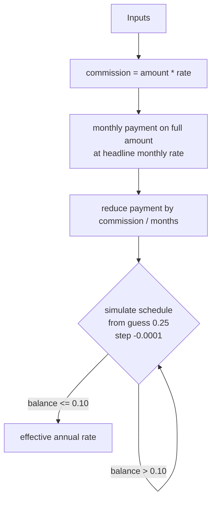

# loans

Solver for the compound-annual rate equivalent to a nominal Greek consumer loan whose monthly outlay is reduced by a one-off partner commission spread evenly across the term.

[](https://github.com/weirdapps/loans/actions/workflows/ci.yml)
[](https://github.com/weirdapps/loans/actions/workflows/codeql.yml)
[](https://github.com/weirdapps/loans/actions/workflows/sonarcloud.yml)
[](LICENSE)
[](https://www.python.org/downloads/)
[](https://github.com/astral-sh/uv)

## What it does

Greek consumer-loan offers are often quoted as a headline annual interest rate with a separate one-off partner (broker) commission of 1 to 3 percent of principal. This project models the scenario where that commission is netted against the monthly instalment (spread evenly across the term), then solves for the compound annual rate at which the full nominal principal would amortise to that reduced instalment.

The four inputs (loan amount, duration in months, headline annual interest rate, partner commission rate) drive both entry points:

- A Flask web UI (`app.py`) with a four-field form.
- A prompt-based Python script (`cli.py`) with the same math in the terminal.

The headline rate is a nominal simple rate divided by 12 for the monthly period; the reported effective rate is the annual equivalent of a compound monthly rate. The two sit on different bases, so they are not directly comparable. With a zero commission the reported rate is the compound-annual equivalent of the headline and therefore lands above it: a headline of 8.5 percent reports 8.83 percent. Raising the commission pulls the reported rate down from that baseline, so it drops below the headline only once the commission is large enough.

## Requirements

- Python 3.11 or newer. CI runs on 3.12; SonarCloud on 3.11.
- [uv](https://github.com/astral-sh/uv) for dependency management. The lockfile is committed.

The single runtime dependency is Flask 3.1 or newer, declared in [`pyproject.toml`](pyproject.toml).

## Installation

Clone and install with uv (recommended, uses the frozen lockfile):

```bash
git clone https://github.com/weirdapps/loans.git
cd loans
uv sync --frozen
```

`uv sync --frozen` creates `.venv/` and installs the pinned versions from `uv.lock` without resolving.

## Usage

### Web UI

```bash
uv run python app.py
```

Open [http://localhost:5000](http://localhost:5000). The form asks for:

| Field | Type |
|-------|------|
| Loan Amount | number |
| Loan Duration (in months) | integer |
| Annual Interest Rate (%) | number |
| Partner's Commission Rate (%) | number |

Submitting posts to `/calculate`, which validates the inputs and re-renders the form on error, or renders `result.html` with the effective rate rounded to two decimals otherwise. Note that `app.py` passes an `error` string to the template but `index.html` has no slot for it, so a rejected submission returns a blank form with no message explaining why. Every response carries these headers:

```http
X-Content-Type-Options: nosniff
X-Frame-Options: DENY
X-XSS-Protection: 1; mode=block
Referrer-Policy: strict-origin-when-cross-origin
```

To enable Flask's debug reloader, export `FLASK_DEBUG=true` before launching:

```bash
FLASK_DEBUG=true uv run python app.py
```

### CLI

```bash
uv run python cli.py
```

The script prompts for the four inputs interactively (there are no flags). Verified sample run:

```text
Enter the loan amount: $25000
Enter the loan duration (in months): 60
Enter the annual interest rate (in percentage): 8.5
Enter the partner's commission rate (in percentage): 2
Annual Rate (after deducting partner's commission): 8.09%
```

On non-convergence the CLI prints an error and exits with status 1; the web UI re-renders the form, again without displaying a reason.

## How it works

The math is identical in `app.py` and `cli.py`:

1. Compute the partner commission as `loan_amount * partner_rate / 100`.
2. Compute the standard monthly payment on the full loan amount at the headline monthly rate (headline annual rate divided by 12, then divided by 100) using the annuity formula.
3. Subtract `commission / duration` from that monthly payment. This is the monthly instalment used by the solver.
4. Search for the annual compound rate at which the full loan amount amortises to the reduced instalment. Starting from an initial guess of 0.25 (25 percent), the solver decrements the guess by 0.0001 each pass, converts it to a monthly rate via `(1 + guess) ** (1/12) - 1`, and simulates the full payment schedule from `remaining_balance = loan_amount`. When the residual balance drops to 0.10 or below, the current guess is returned as the effective annual rate.
5. A hard ceiling of `MAX_ITERATIONS = 1_000_000` guards against non-convergence.

Note that the headline rate uses simple monthly compounding (`headline / 12`) while the solved rate uses compound monthly compounding (`(1 + r) ** (1/12) - 1`), so the two rates are not directly comparable even when the commission is zero. At a headline of 8.5 percent over 60 months the reported rate runs 8.83, 8.65, 8.46, 8.09 and 7.71 percent for commissions of 0, 0.5, 1, 2 and 3 percent. The result does not depend on the loan amount, because the commission is proportional to it.



## Project layout

```text
app.py                 Flask app: GET / + POST /calculate + security headers
cli.py                 Standalone prompt-driven script
templates/index.html   Form
templates/result.html  Result page
static/style.css       Form styles
tests/conftest.py      Flask app + client fixtures
tests/test_app.py      App creation, calculation, and validation tests
pyproject.toml         Project metadata, dependencies, ruff, mypy, pytest config
uv.lock                Pinned dependency versions
```

Flat layout by design (`[tool.uv] package = false` in `pyproject.toml`); the project is not published as an installable package.

## Configuration

| Variable | Purpose | Default |
|----------|---------|---------|
| `FLASK_DEBUG` | Enables Flask debug mode when running `app.py` directly. Any value other than `true` (case-insensitive) leaves debug off. | unset (off) |

## Development

Install the dev dependency group and run the toolchain with uv:

```bash
uv sync --frozen
uv run ruff check .
uv run pytest
```

`pytest` is wired via `pyproject.toml` to run with `--cov` and emit `coverage.xml` (consumed by the SonarCloud workflow). The test suite covers app creation, security headers, five loan-calculation scenarios, and six input-validation cases.

Pre-commit hooks are configured in [`.pre-commit-config.yaml`](.pre-commit-config.yaml): standard hygiene checks, `ruff` and `ruff-format`, `mypy`, `gitleaks`, `yamllint` on workflow files, and `markdownlint`. `pre-commit` is deliberately not in the dev dependency group, so run it as a standalone tool rather than through `uv run`:

```bash
uvx pre-commit install
```

## CI

Five GitHub Actions workflows live in `.github/workflows/`:

- `ci.yml`: on push and PR to `master`, installs from the frozen lockfile, byte-compiles `app.py` and `cli.py`, runs `ruff check`, then `pytest`. Also manually dispatchable against any branch; a dispatched run additionally mirrors its result into a `CI (dispatched)` commit status, because a dispatched run's check run does not join a pull request's status rollup.
- `codeql.yml`: CodeQL security analysis on push, PR, a weekly cron (Mondays at 06:00 UTC), and manual dispatch.
- `sonarcloud.yml`: coverage upload to SonarCloud on push to `main` or `master` and on human-authored PRs (Dependabot PRs are skipped because they cannot see `SONAR_TOKEN`).
- `deps-refresh.yml`: monthly (day 9 at 04:41 UTC) `uv lock --upgrade`, re-runs the full CI gate (syntax, lint, tests), and opens a `deps/monthly-refresh` PR if anything changed. It then dispatches `ci.yml` against that branch, because GitHub refuses to start `pull_request` runs for a PR opened with `GITHUB_TOKEN` and the PR would otherwise carry no checks at all. The dispatched run reports back as the `CI (dispatched)` commit status.
- `dependabot-auto-merge.yml`: a thin caller of the shared reusable workflow at `weirdapps/shared-workflows/.github/workflows/dependabot-auto-merge.yml@main`. It auto-merges Dependabot patch, minor, and grouped updates; standalone major bumps stay open for manual review. The merge logic lives in the shared repo, so behaviour changes belong there, not here.

Dependabot itself is configured in [`.github/dependabot.yml`](.github/dependabot.yml) to watch both `github-actions` and the `uv` ecosystem on a weekly cadence, with minor and patch updates grouped.

## Security

Vulnerability reports go to <plessas@nbg.gr>. Full policy in [`SECURITY.md`](SECURITY.md).

## License

[MIT](LICENSE), Copyright (c) 2026 Dimitris Plessas.
