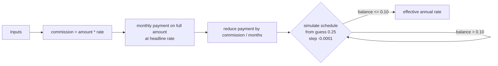

# loans

Effective-rate calculator for consumer loans that carry a one-off broker commission on top of the headline interest rate.

[](https://github.com/weirdapps/loans/actions/workflows/ci.yml)
[](https://github.com/weirdapps/loans/actions/workflows/codeql.yml)
[](https://github.com/weirdapps/loans/actions/workflows/sonarcloud.yml)
[](LICENSE)
[](https://www.python.org/downloads/)
[](https://github.com/astral-sh/uv)

## What it does

Greek consumer-loan offers are frequently quoted as "X% interest" while burying a one-off partner (broker) commission of 1 to 3 percent of principal. That fee is deducted from the disbursement but you still amortise the full nominal amount at the headline rate, so the true annual cost is higher than advertised.

This project gives you two ways to compute the real effective annual rate:

- A Flask web UI (`app.py`) with a four-field form.
- A prompt-based Python script (`cli.py`) for the same math in the terminal.

Both entry points take the same four inputs (loan amount, duration in months, annual interest rate, partner commission rate) and return the effective annual rate net of the commission.

## Requirements

- Python 3.11 or newer (CI runs on 3.12).
- [uv](https://github.com/astral-sh/uv) for dependency management. The lockfile is committed.

The single runtime dependency is Flask 3.1 or newer, declared in [`pyproject.toml`](pyproject.toml).

## Installation

Clone and install with uv (recommended, uses the frozen lockfile):

```bash
git clone https://github.com/weirdapps/loans.git
cd loans
uv sync --frozen
```

`uv sync --frozen` creates `.venv/` and installs the pinned versions from `uv.lock` without resolving.

## Usage

### Web UI

```bash
uv run python app.py
```

Open [http://localhost:5000](http://localhost:5000). The form asks for:

| Field | Type |
|-------|------|
| Loan Amount | number |
| Loan Duration (in months) | integer |
| Annual Interest Rate (%) | number |
| Partner's Commission Rate (%) | number |

Submitting posts to `/calculate`, which validates the inputs and re-renders the form on error, or renders `result.html` with the effective rate rounded to two decimals otherwise. Every response carries the following headers:

```http
X-Content-Type-Options: nosniff
X-Frame-Options: DENY
X-XSS-Protection: 1; mode=block
Referrer-Policy: strict-origin-when-cross-origin
```

To enable Flask's debug reloader, export `FLASK_DEBUG=true` before launching:

```bash
FLASK_DEBUG=true uv run python app.py
```

### CLI

```bash
uv run python cli.py
```

The script prompts for the four inputs interactively (there are no flags):

```text
Enter the loan amount: $25000
Enter the loan duration (in months): 60
Enter the annual interest rate (in percentage): 8.5
Enter the partner's commission rate (in percentage): 2
Annual Rate (after deducting partner's commission): 9.34%
```

## How it works

The math is identical in `app.py` and `cli.py`:

1. Compute the partner commission as `loan_amount * partner_rate / 100`.
2. Compute the standard monthly payment on the full loan amount at the headline monthly rate using the annuity formula.
3. Subtract the commission spread evenly across the term from that monthly payment. This is the effective monthly outlay against the reduced disbursement.
4. Search for the annual rate that fully amortises the loan at the reduced payment. Starting from an initial guess of 0.25 (25 percent), the solver decrements the guess by 0.0001 each pass, converts it to a monthly rate, and simulates the full payment schedule. When the residual balance drops below 0.10, the current guess is returned as the effective annual rate.
5. A hard ceiling of `MAX_ITERATIONS = 1_000_000` guards against non-convergence.



## Project layout

```text
app.py               Flask app: GET / + POST /calculate + security headers
cli.py               Standalone prompt-driven script
templates/index.html Form
templates/result.html Result page
static/style.css     Form styles
tests/conftest.py    Flask app + client fixtures
tests/test_app.py    App creation, calculation, and validation tests
pyproject.toml       Project metadata, dependencies, ruff, mypy, pytest config
uv.lock              Pinned dependency versions
```

Flat layout by design (`[tool.uv] package = false` in `pyproject.toml`); the project is not published as an installable package.

## Configuration

| Variable | Purpose | Default |
|----------|---------|---------|
| `FLASK_DEBUG` | Enable Flask debug mode when running `app.py` directly. Any value other than `true` (case-insensitive) leaves debug off. | unset (off) |

## Development

Install the dev dependency group and run the toolchain with uv:

```bash
uv sync --frozen
uv run ruff check .
uv run pytest
```

`pytest` is wired via `pyproject.toml` to run with `--cov` and emit `coverage.xml` (consumed by the SonarCloud workflow).

Pre-commit hooks are configured in [`.pre-commit-config.yaml`](.pre-commit-config.yaml): standard hygiene checks, `ruff` and `ruff-format`, `mypy`, `gitleaks`, `yamllint` on workflow files, and `markdownlint`. Install with:

```bash
uv run pre-commit install
```

## CI

Five GitHub Actions workflows live in `.github/workflows/`:

- `ci.yml`: on push and PR to `master`, installs from the frozen lockfile, byte-compiles `app.py` and `cli.py`, runs `ruff check`, then `pytest`.
- `codeql.yml`: CodeQL security analysis on push, PR, and a weekly cron.
- `sonarcloud.yml`: coverage upload to SonarCloud on push to `master` and human-authored PRs (Dependabot PRs are skipped because they cannot see `SONAR_TOKEN`).
- `deps-refresh.yml`: monthly `uv lock --upgrade`, re-runs the tests, and opens a `deps/monthly-refresh` PR if anything changed.
- `dependabot-auto-merge.yml`: auto-merges Dependabot patch and minor updates (majors still require manual review).

## Security

Vulnerability reports go to <plessas@nbg.gr>. Full policy in [`SECURITY.md`](SECURITY.md).

## License

[MIT](LICENSE), Copyright (c) 2026 Dimitris Plessas.
